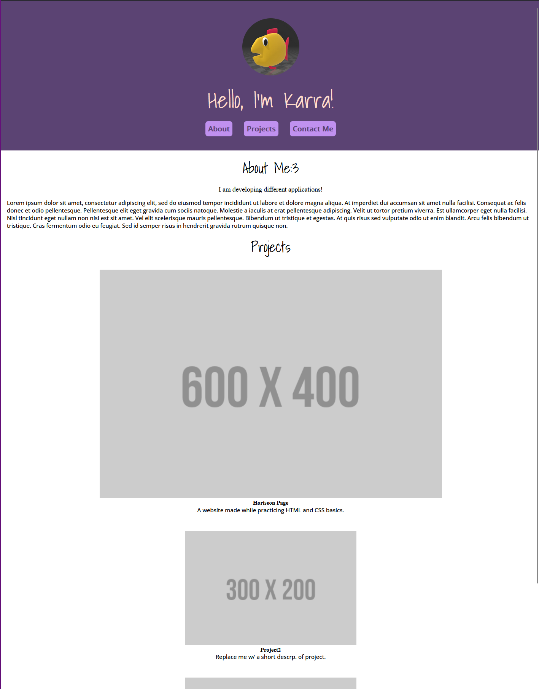

# Portfolio Website

## Description

This application serves as a portfolio to showcase the projects I have been working on.

Below is a screenshot of the website and the link to it.

[Portfolio Website Link](https://purplepeopleeated.github.io/my-portfolio/)

## Usage

Click on the different links in the navigation bar, and they will take you to that section of the page.

You can also click on the images, and they will take you to that project's website!

## Credits

Articles Used:
- [MDN Docs](https://developer.mozilla.org/)
- [w3schools](https://www.w3schools.com/)
- [Minimal CSS Reset](https://www.digitalocean.com/community/tutorials/css-minimal-css-reset)